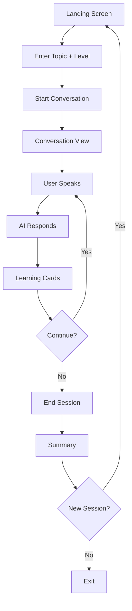

# Parla-AI UX Design Specification

_Created on 2025-11-27 by Michal_
_Generated using BMad Method - Create UX Design Workflow v1.0_

---

## Executive Summary

**Project:** Parla AI – A voice-first web application that helps adult Polish speakers (A2–B2) practice Italian conversation in a safe, judgment-free space.

**Vision:** Provide natural AI conversation practice with bilingual code-switching support and real-time visual learning feedback so learners build confidence speaking Italian without needing a human tutor or logging in.

**Target Users:** Adults in Poland who can read/write Italian but freeze when speaking, need private practice at home, and want immediate corrective feedback.

**Design Pillars:**
- Voice-first interactions are effortless and anxiety-free.
- Learning Cards deliver value without interrupting conversation flow.
- No-login experience keeps friction near zero.
- Accessibility and inclusivity ensure any learner can participate.

---

## 1. Design System Foundation

### 1.1 Design System Choice

- **Base System:** [shadcn/ui](https://ui.shadcn.com) (Tailwind CSS + Radix primitives)
- **Why:** Modern, accessible, highly themeable, strong developer ergonomics.
- **Provided Components:** Buttons, forms, cards, modals, alerts, navigation primitives, focus management utilities, typography tokens.
- **Custom Components Needed:**
  1. Learning Card (vocabulary + grammar corrections)
  2. Voice Interaction UI (microphone + transcription status)
  3. Split-View Conversation Layout (conversation + notes)
  4. Session Summary (post-session review without persistence)

---

## 2. Core User Experience

### 2.1 Defining Experience

> "It's the app where you have natural Italian conversations with AI, and it helps you learn in real-time without judgment."

- **Core Action:** Speak Italian (with Polish mixed in) and receive immediate AI response + Learning Cards.
- **What Must Be Effortless:** Starting a session, talking freely, glancing at Learning Cards, copying notes.
- **Platform:** Browser-based SPA optimized for desktop/tablet, with future mobile support.

### 2.2 Novel UX Patterns – Real-Time Learning Cards

**Purpose:** Surface vocabulary and grammar insights during live voice conversations without breaking flow.

| Aspect | Decision |
| --- | --- |
| Trigger | AI detects learning opportunity while processing transcription |
| Feedback | Card slides in from right panel with subtle animation |
| Content | Vocabulary cards show new Italian word + Polish translation; correction cards show mistake vs correct form |
| States | Default, arrival highlight, hover (copy visible), copied (checkmark), error |
| Accessibility | Screen reader announcement: "New vocabulary card: immersivo – immersyjny"; keyboard navigation + enter to copy |
| Platform | Desktop/tablet = split panel; mobile (future) = bottom sheet |

---

## 3. Visual Foundation

### 3.1 Color System – "Modern Italian Café"

Palette references the Italian flag through Emerald Green + Modern Coral, balanced by espresso neutrals.

| Color Type | Hex | Name | Usage |
| --- | --- | --- | --- |
| Background | `#F9FAFB` | Latte White | App background, calming base |
| Primary | `#10B981` | Emerald Green | Primary actions, microphone states |
| Secondary | `#F43F5E` | Modern Coral | Highlights, secondary actions |
| Surface | `#FFFFFF` | Pure White | Cards, conversation bubbles |
| Text Main | `#1F2937` | Espresso Black | Primary text |
| Text Muted | `#6B7280` | Stone Gray | Helper text |

**Extended Tokens:**
- Primary Dark `#0B8A6E`, Primary Light `#E6FBF3`
- Secondary Dark `#C32C48`, Secondary Light `#FFE7EB`
- Border Neutral `#E5E7EB`, Disabled Text `#9CA3AF`
- Success `#10B981` on `#E6FBF3`
- Warning `#FBBF24` on `#FFF8E6`
- Error `#F43F5E` on `#FFE7EB`
- Info `#3B82F6` on `#E1EDFF`

**Learning Cards:**
- Vocabulary: Background `#E6FBF3`, border `#A7E8CF`, emerald icon.
- Corrections: Background `#FFE7EB`, border `#F8B4C3`, coral icon.

### Typography
- **Family:** Inter (headings + body), JetBrains Mono (technical snippets if needed).
- **Scale:** H1 32px / 1.2, H2 24px / 1.3, H3 20px / 1.4, H4 18px / 1.4, Body 16px / 1.6, Body Small 14px / 1.6, Caption 12px / 1.5.
- **Weights:** 400 regular, 500 medium, 600 semibold, 700 bold (sparingly to avoid anxiety).

### Spacing & Layout
- **Spacing System:** 8px base (4, 8, 16, 24, 32, 48, 64).
- **Grid:** Desktop 12-column up to 1400px; Tablet 12-column fluid; Mobile single column.
- **Containers:** Desktop max 1400px centered, Tablet full-width with 24px padding, Mobile full-width with 16px padding.

**Interactive Visualizer:** `docs/ux-color-themes.html`

---

## 4. Design Direction – "Spacious Conversation"

- **Layout:** 60/40 split (conversation left, Learning Cards right) with independent scrolling.
- **Density:** Spacious, breathing room, large type, no clutter.
- **Navigation:** Minimal top bar (topic indicator, End Session), no side nav.
- **Visual Weight:** Soft shadows, 1px borders, no gradients; conversation remains hero.
- **Interaction Pattern:** Inline Learning Cards, progressive disclosure, click-to-copy.
- **Rationale:** Reduces anxiety, keeps value visible, aligns with "safe practice" brand promise.

*(Design direction HTML showcase can be generated later at `docs/ux-design-directions.html`.)*

---

## 5. User Journey Flows

### Journey 1 – Start Conversation
1. **Landing:** Topic input (Polish), proficiency toggle (A2/B1/B2), Start button.
2. **Validation:** Default to B1 if none chosen; gentle prompt when topic empty.
3. **Transition:** Smooth load into conversation view with microphone ready.

### Journey 2 – During Conversation
1. **User Speaks:** Microphone shows "Listening", transcription appears live.
2. **AI Responds:** Conversation bubble + voice playback, microphone switches to "AI Speaking".
3. **Learning Cards:** Slide in sequentially, never block audio; user can copy individually or all.

### Journey 3 – End & Review
1. **End Session:** Accessible button; optional confirmation.
2. **Summary:** Topic, duration, level + full Learning Card list with copy-all.
3. **Next Step:** Start new session or close (no data stored server-side).

---

## 6. Component Library Strategy

1. **Learning Card** – Vocabulary/correction content, icon, copy control, timestamp. States: default, new, hover, copied, error. Accessible via ARIA labels and keyboard.
2. **Voice Interaction UI** – Microphone icon, status text (Ready/Listening/Processing/AI Speaking), waveform pulse. ARIA live region for state changes.
3. **Split-View Layout** – Responsive container managing conversation + card panel; supports independent scroll + future collapse.
4. **Session Summary** – Metadata header + Learning Card grid/list + Copy All + Start New session CTA.

---

## 7. UX Pattern Decisions

- **Buttons:** Primary (emerald solid), Secondary (coral solid), Tertiary (ghost), Destructive (rare, coral outline).
- **Feedback:** Toasts for success/error/info, inline warnings, skeleton loaders during init.
- **Forms:** Labels above inputs, required indicator "* Required", on-blur validation, inline errors.
- **Modals:** Three sizes, click-out + ESC close, focus trapping, single modal at a time.
- **Navigation:** Top bar highlight for active state, no breadcrumbs, browser back works naturally.
- **Empty States:** Friendly guidance for first-use and no-card states.
- **Confirmations:** Only for End Session or irreversible actions.
- **Notifications:** Top-right stack max 3, success auto-dismiss 3s, error manual.
- **Date/Time:** Relative labels ("Just now") for immediate context; future features can expand.

---

## 8. Responsive & Accessibility Strategy

### Breakpoints
- **Desktop (≥1024px):** Split-view 60/40, mouse + keyboard.
- **Tablet (768–1023px):** Split-view 55/45, touch targets 52px, sticky controls.
- **Mobile (<768px, future):** Stacked layout with Learning Cards in bottom sheet.

**Adaptations:** Navigation collapses to minimal icon row; cards reposition below conversation; forms become single column; modals full-screen on mobile.

### Accessibility (WCAG 2.1 AA Target)
- Color contrast ≥4.5:1 for text, ≥3:1 for large text/icons.
- Full keyboard navigation with visible focus ring.
- Screen reader support using semantic headings, ARIA live regions for new cards, labelled buttons.
- Respect `prefers-reduced-motion` and high-contrast OS settings.
- Testing: Lighthouse + axe automated scans, manual keyboard walkthrough, NVDA/VoiceOver checks.

---

## 9. Implementation Guidance & Completion Summary

**Deliverables:**
- UX Design Specification: `docs/ux-design-specification.md`
- Color Theme Visualizer: `docs/ux-color-themes.html`
- Design Direction Mockups: `docs/ux-design-directions.html` (optional follow-up)

**Summary:**
- Design system chosen (shadcn/ui) with 4 custom components.
- Modern Italian Café visual language defined with interactive palette.
- Core experience anchored around split-view conversation + Learning Cards.
- Three key user journeys mapped with flow diagram.
- UX pattern decisions documented to ensure consistency.
- Responsive + WCAG AA strategy ensures inclusivity.

**Next Recommended Workflow:** `workflow create-architecture`
- Architecture can now leverage PRD + UX context for system design.
- After architecture, run `workflow create-epics-and-stories` for implementation planning.

---

_This UX Design Specification was created through collaborative design facilitation. Decisions balance Italian cultural inspiration with calm, supportive learning experiences._
